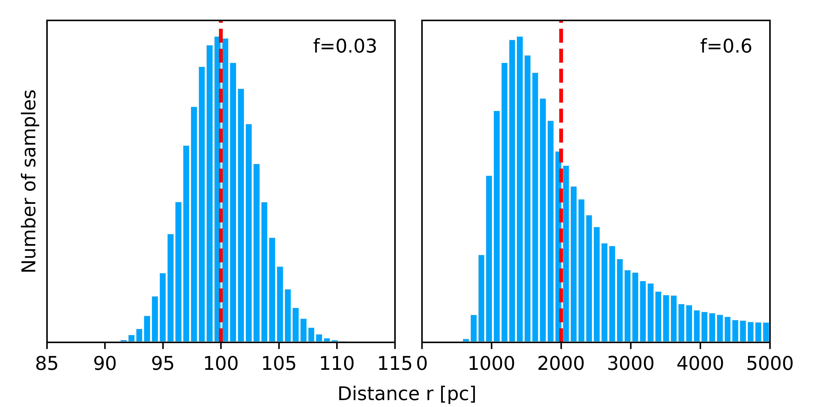

# Calculating distances from uncertain parallax measurements

This is a Python program that plots measured stellar distances from simulated parallaxes. The plot demonstrates that one can not just use the standard distance = 1/parallax formula when parallax
measurements are uncertain or negative, which is true for most stars in Gaia's DR2 catalog. Instead, the parallaxes need to be inferred using statistical inference.

This is a recreation of Figure 3 in [Luri X et. al (2018)](https://arxiv.org/abs/1804.09376).




## Setup

Use the following steps to install Python environment and run the code.

* Download the code:

```
git clone https://github.com/evgenyneu/distance_from_parallax.git
```

* Install [Miniconda](https://docs.conda.io/en/latest/miniconda.html).

* Create a Conda environment.

```
conda create --name parallax42 python=3.7
```

* Activate the environment:

```
conda activate parallax42
```

* Install Python libraries listed in `requirements.txt` file:

```
pip install -r requirements.txt
```

## Running the program

```
python parallax.py
```

The program will create [measured_distances.pdf](measured_distances.pdf) plot.


## Cleaning up

When you finished running the code, remove the Conda environment:

```
conda deactivate
conda env remove -n parallax42
```

## License

This code is in [Public Domain](LICENSE).
